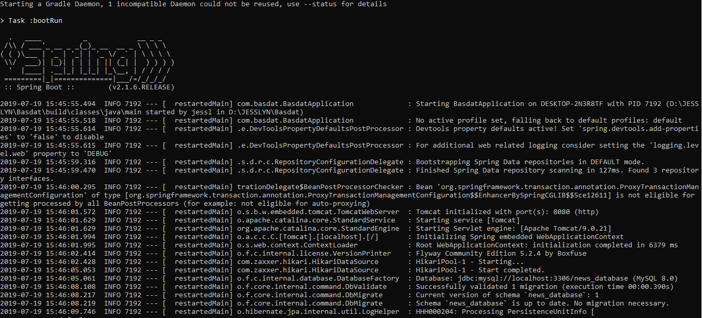
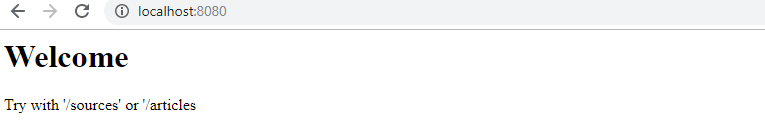
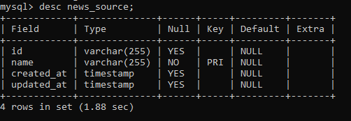
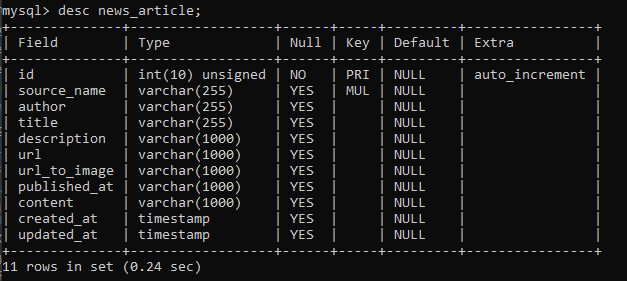
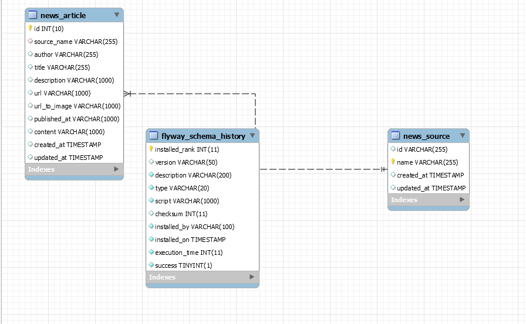

<h1 align="center">
  <br>
  Seleksi 2 Warga Basdat 2019
  <br>
  <br>
</h1>

# Data Storing

## Descriptions
<b>NOTE</b> : Refer to this <a href = "https://github.com/jesslyn1999/pre-Seleksi-2019-Tugas-2.git">repository</a> BEFOREHAND to learn how to get the related JSON file; `.\data\dataJson.json`, using REST API Request Method.

<br>
MySQL as an open-source relational database management system(RDBMS) is used in this project. MySQL is well-known for being the most secure and reliable DBMS in web applications like WordPress, Facebook, etc. Other benefits in applying MySql into projects can be explored more on <a href = "https://www.datamation.com/storage/8-major-advantages-of-using-mysql.html">this article</a>. MySQL was designed for speed and reliability. Applications using MySQL can access it through separate daemon process. An existed server stands between this database and other applications allows greater control over who has access to the database and thus makes it secure. MySQL has inspired a wealth of third-party applications, tools, and integrated libraries that extend its functionality and help make it easier to work with. Some of the more widely-used of these third-party tools are phpMyAdmin, DBeaver, and HeidiSQL.


This project's main objective is to save the json file provided into the system of DBMS so that it can be used for further analysis and visualisations. The project currently only supports Java as the medium. MySQL installer itself has provided tool such as Connector/J(<a href = "https://www.javatpoint.com/java-jdbc">JDBC</a>) which supports Java connection. From Java side, there's <a href = "https://docs.spring.io/spring-data/jpa/docs/current/reference/html">JPA</a> library too which also supports MySQL queries validations and repository applications thus make it easier for developers to integrate and manage this database system.

<br>
References: https://www.digitalocean.com/community/tutorials/sqlite-vs-mysql-vs-postgresql-a-comparison-of-relational-database-management-systems


## Prerequisites
1. Download <a href = "https://dev.mysql.com/downloads/mysql">MySQL server</a>


## Setup
#### Configurations
1. Create MySql database as follows:
  <br>name: `news_database`
  <br>username: `root`
  <br>password: `root`
  <br>port: `3306 (default)`
2. Clone this repository

#### Build and Run Project
Build and Run your Project with:
```
gradlew bootrun
```

While running on the project, open another terminal and run:
```
curl "localhost:8080"
```

You can see the lists of saved repositories at
```
curl "localhost:8080/sources"
curl "localhost:8080/articles"
```

Lastly, run this command at the terminal
```
mysqldump -u root -p news_database > export\news.sql
```

You might want to change the imported json path. You may configure this settings at `src\main\resources\application.properties` at field of `news.save.json.path` But beware that the current source code supported only the format fields from the related JSON file.


## Tools, Servers, Frameworks, Plugins and Libraries
  1. <a href = "https://gradle.org/">Gradle</a>
  2. <a href = "https://www.mysql.com/">MySQL</a>
  3. <a href = "https://spring.io/projects/spring-boot">Spring Boot</a>
  4. <a href = "https://spring.io/projects/spring-data-jdbc">Spring Data JDBC</a>
  5. <a href = "https://spring.io/projects/spring-data-jpa">Spring Data JPA</a>
  6. <a href="https://flywaydb.org/documentation/plugins/springboot">Flyway</a>
  7. <a href = "https://projectlombok.org/">Project Lombok</a>
  
  
## Screenshots











## Next Improvisations
  - [x] Done with initial development
  - [ ] Apply docker
  - [ ] Flexible input type
  - [ ] Unit Testing


## Author
<p>
  <br>
  <b> Jesslyn Nathania - 13517053 </b>
  <br>
  <br>
</p>
